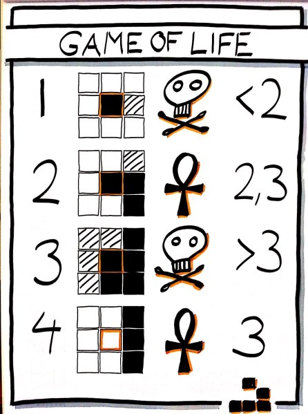

# Conway_GameOfLife

This is an implementation of Conway's Game of Life in C++. Build and run it directly with [Qt Creator](https://www.qt.io/download).

## Description

According to [Wikipedia](https://en.wikipedia.org/wiki/Conway%27s_Game_of_Life), "the **Game of Life**, also known simply as **Life**, is a cellular automaton devised by the British mathematician John Horton Conway in 1970".

Given a board with *m* by *n* cells, each cell has an initial state *live* (1) or *dead* (0). Each cell interacts with its [eight neighbours](https://en.wikipedia.org/wiki/Moore_neighborhood) (horizontal, vertical, or diagonal) using the following four rules:

  
   <i>Source: https://qualityswdev.com/2011/07/31/conways-game-of-life-in-scala/</i>

1. Any live cell with fewer than two live neighbors dies, as if caused by under-population *(symbiosis?)*.
2. Any live cell with two or three live neighbors lives on to the next generation *(ideal population density)*.
3. Any live cell with more than three live neighbors dies, as if by over-population *(scarce nutrients)*.
4. Any dead cell with exactly three live neighbors becomes a live cell, as if by reproduction *(ideal population density)*.

## Demo

*coming soon...*

## Requirements

* Qt (tested with version 5.14.2)
* Qt Creator (tested with version 4.12.1)

## License

[GNU General Public License v3.0](https://github.com/liweiyap/Conway_GameOfLife/blob/master/LICENSE)
